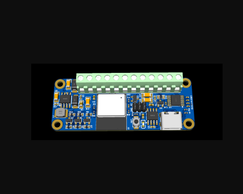
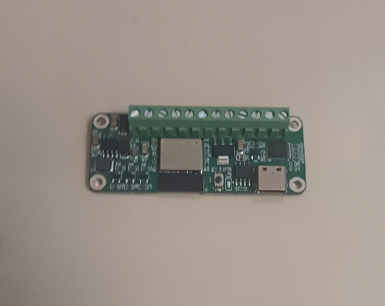

# PCBCrew ™  ESP32 High Voltage IO Board

> Designed for [TowerSoftware ™][tower]

ESP32-C3 powered encoder controller with voltage level translator and CAN transciever.

| 3D Preview                                                        | PCBA                                                             |
| ----------------------------------------------------------------- | ---------------------------------------------------------------- |
|  |  |

## Overview

An ESP32-C3 powered encoder controller with voltage level translator and CAN transciever.

* ESP32-C3
* 3-ch Voltage level translator using MOSFETs
* CAN bus transceiver
* RS232 transceiver

## Revisions

### 1.2

* Replaced XC6206 weak LDO with stronger AMS1117
* PCB antenna cutout for better RF performance

### 1.1

* Diodes between +5V and VUSB rails are removed.
* Added 2 x 100uF and 1 x 47uF capacitors to supply enough current when wifi starts up

### 1.0

* Initial release.

## Project Ownership

This repository is hosted on [PCBCrew Org](https://github.com/pcbcrew-org) for backup.
The copyright of this hardware design is owned by [TowerSoftware ™][tower].

---

[pcbcrew]: https://pcbcrew.com
[tower]: https://www.towersoftwareltd.com
